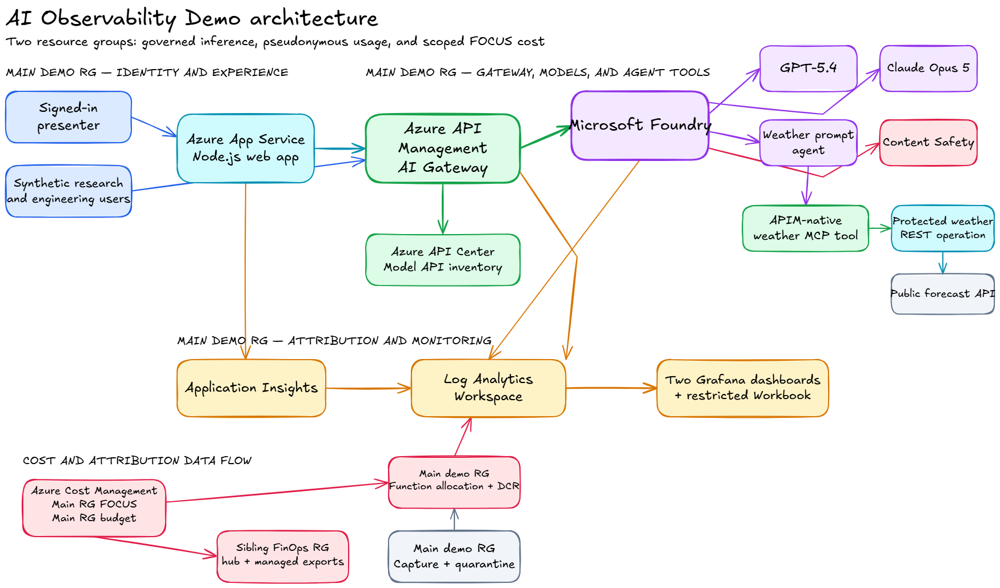

# AI Observability Demo

This project demonstrates how to observe and govern a shared AI platform on Azure.
It connects model requests, agent activity, safety controls, application telemetry,
resource health, usage attribution, and billed cost.

The deployment uses Azure Developer CLI (`azd`) and Bicep. It provisions Microsoft
Foundry, Azure API Management, API Center, App Service, Application Insights,
Log Analytics, Cost Management resources, an Azure Monitor workbook, and an Azure
Monitor dashboard with Grafana.

## What the demo shows

- Governed access to GPT-5.4 and Claude Opus 5 through one AI gateway.
- Entra authentication for interactive users.
- Team and synthetic-user attribution for generated traffic.
- Model, token, latency, quota, reliability, and guardrail telemetry.
- Prompt Shields and Protected Material for Code.
- A Foundry weather agent that calls one read-only APIM MCP tool.
- Resource-group FOCUS actuals, rate-card estimates, and pseudonymous cost allocation.
- Two Grafana dashboards and one restricted investigation workbook.

## Architecture

Microsoft Foundry hosts the model deployments and the optional prompt agent.
API Management validates access, applies controls, routes requests, and emits
token telemetry. The web application supplies repeatable user journeys.
Application Insights and Log Analytics store operational signals. A sibling FinOps
support resource group processes managed FOCUS exports for the main demo resource
group. Cost Management remains the source for billed cost.



Read the [architecture description](docs/architecture.md) for the component details.

## Prerequisites

- An Azure subscription with rights to create two resource groups, the documented
  resources, subscription-level role assignments, budgets, and managed exports.
- Azure CLI with Bicep support.
- Azure Developer CLI.
- PowerShell 7.
- Node.js 24.
- Microsoft Foundry model access and quota in the selected Azure location.
- Azure Marketplace permission and quota for the Hosted on Azure Version 2 `claude-opus-5` offer.

## Deploy

`azd up` is the one deployment command. It creates the main demo resource group
and configures the sibling FinOps support resource group.

```powershell
az login
azd auth login
azd env new ai-observability-demo
azd env set AZURE_LOCATION <azure-location>
azd env set AZURE_PRINCIPAL_ID <entra-object-id>
azd up
```

App Service uses `AZURE_LOCATION` by default. Set an override only when required:

```powershell
azd env set AZURE_APP_SERVICE_LOCATION <app-service-location>
```

The deployment hooks configure the Entra application, secure session settings,
APIM audience, weather MCP connection, Foundry weather agent, and FinOps hub.
The FinOps hook uses two passes. It first deploys the hub, then grants its Data
Factory identity access to the main resource group. The second pass enables the
managed FOCUS exports for only that resource group.

`azd up` verifies the export configuration. FOCUS billing data is delayed and can
remain unavailable until Cost Management completes an export.

Follow the [runbook](docs/RUNBOOK.md) for prerequisites, verification, troubleshooting,
traffic generation, and teardown.

## Remove the deployment

`azd down --force --purge` is the one active-resource removal command. Its
lifecycle hooks remove both active resource groups and their external role
assignments. It does not purge the purge-protected Key Vault or remove the Entra
app registration created by the post-provision hook.

Run the complete cleanup command:

```powershell
pwsh ./demo-scripts/teardown.ps1
```

The script requires confirmation. It runs `azd down --force --purge` first.
It then checks both resource groups, purges deleted Foundry and API Management
services, deletes the app registration recorded in `ENTRA_CLIENT_ID`, and removes
the local `azd` environment. Key Vault purge protection keeps deleted vault data
recoverable for its Azure retention period. A later `azd up` recovers the vault
when its name is still reserved. The Claude Marketplace subscription remains
outside the resource groups and requires a separate review.

## Present the demo

Open `demo-scripts/presenter.html` directly for the static guide.
Deployment-only buttons stay hidden until the launcher supplies valid configuration.

Open the configured presenter after deployment:

```powershell
pwsh ./demo-scripts/open-presenter.ps1 -Slide 1 -Range 24h
```

Use the [presenter run script](demo-scripts/run-demo.md) for the short sequence.
Use the [cost governance walkthrough](docs/cost-governance-demo.md) for the full sequence.

## Documentation

The [documentation index](docs/README.md) links all user, operator, presenter,
component, and design documents.

## Data and security boundary

- Use approved public or synthetic input.
- Do not enter proprietary source code, personal data, credentials, or secrets.
- APIM diagnostics exclude prompt and completion bodies.
- APIM creates an HMAC pseudonym before usage events enter Event Hubs.
- The usage pipeline retains no raw object ID, email address, access token,
  subscription key, or IP address.
- Local `azd` state and environment files are ignored by Git.
- The deployment uses public PaaS endpoints and audit policy assignments.
- Add workload-specific network controls, alert routing, service objectives, and evaluations before production use.

## Acknowledgements

[Lester March's Core AI Platform Demo](https://github.com/lestermarch/core-ai-platform-demo)
laid the groundwork for this project. This implementation builds on that foundation
with expanded AI gateway, observability, FinOps, guardrail, and presenter scenarios.

The Claude deployment follows the Microsoft-maintained
[Azure-Samples/claude](https://github.com/Azure-Samples/claude) Bicep pattern.

## License

This project is licensed under the [MIT License](LICENSE).
See [NOTICE.md](NOTICE.md) for third-party notices.
